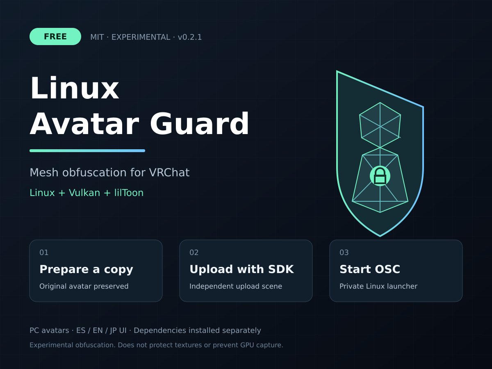

# Linux Avatar Guard

Gratis, open source y experimental. Ofuscación de geometría para avatares VRChat PC con lilToon, preparada desde Unity nativo para Linux con Vulkan. La herramienta crea una copia independiente; conserva el avatar original y guarda las claves fuera del proyecto.

**[Descargar 0.2.1](https://github.com/AlexiStwby/LinuxAvatarGuard/releases/tag/v0.2.1)** · [Guía en español](Package/Assets/LinuxAvatarGuard/README.es.md) · [English guide](Package/Assets/LinuxAvatarGuard/QUICKSTART.en.md) · [日本語ガイド](Package/Assets/LinuxAvatarGuard/QUICKSTART.jp.md) · [MIT](LICENSE)



## Instalación y uso

1. Prepara un proyecto de avatar con VRChat SDK Avatars, lilToon y Python 3. Abre Unity en Linux con Vulkan e importa `LinuxAvatarGuard-0.2.1.unitypackage` desde la release.
2. Selecciona el avatar y abre **Tools > Linux Avatar Guard > Asistente**. Pulsa **Comprobar y preparar avatar** y revisa la copia en su escena de subida.
3. Publica con el SDK, pulsa **Vincular avatar publicado** y después **Iniciar desbloqueo OSC** con OSC activado en VRChat. También puedes usar el lanzador privado sin mantener Unity abierto.

El asistente permite elegir ES / EN / JP arriba de la ventana; español es el idioma predeterminado. El cambio es inmediato y se guarda entre sesiones del Editor. No necesitas editar JSON ni instalar módulos de Python. Desde 0.1.1 puedes reconocer una copia existente sin regenerar o volver a publicar un avatar funcional. La actualización desde 0.2.0 conserva los perfiles existentes.

Validado con Unity 2022.3.22f1, SDK Avatars 3.10.5 y lilToon 2.3.4 en Built-in Render Pipeline. La preparación es exclusiva de Linux; el avatar publicado es Windows PC. Gesture Manager es opcional para comprobar las capas FX en Play Mode.

## Alcance

Es ofuscación, no cifrado fuerte. No protege texturas, no impide capturas GPU y no garantiza impedir toda extracción. Las claves se sincronizan para que otros clientes dibujen el avatar y pueden recuperarse. Sin OSC, con claves incorrectas o con shaders/animaciones bloqueados por Safety, la malla puede verse deformada.

Skinning y compatibilidad siguen siendo experimentales. Para Modular Avatar, Avatar Optimizer o VRCFury, hornea primero una copia final; no se eliminan automáticamente sus componentes. Consulta la [guía](Package/Assets/LinuxAvatarGuard/README.es.md) para variantes lilToon compatibles, restricciones y copias de seguridad.

## Código y desarrollo

- `Package/Assets/LinuxAvatarGuard/`: scripts del Editor, desbloqueador OSC y documentación que se distribuyen a Unity.
- `Tests/`: pruebas genéricas de geometría, shaders y OSC; no contienen modelos de terceros.
- `dist/booth/`: imágenes originales, descripción y validación de la release. Los archivos descargables se publican en GitHub Releases.

Para trabajar desde el código, copia `Package/Assets/LinuxAvatarGuard/` y su archivo `.meta` a `Assets/` en tu proyecto compatible. No copies `Tests/` al proyecto de un usuario final.

Pruebas OSC, desde la raíz del repositorio:

```sh
python3 -m unittest discover -s Tests -p 'test_osc.py' -v
```

Para exportar, usa **Tools > Linux Avatar Guard > Exportar herramienta para distribuir** en Unity y guarda el archivo como `dist/LinuxAvatarGuard-0.2.1.unitypackage`. Después ejecuta `python3 Tests/build_release.py` para crear los ZIP públicos y sus hashes. El exportador excluye dependencias de avatares y claves. Consulta el [informe de validación](dist/booth/RELEASE-VALIDATION.md).

Aceptamos issues y pull requests. Indica versiones de Unity/SDK/lilToon y pasos para reproducir el problema; no adjuntes claves privadas ni avatares de terceros sin permiso.

## English

Free, MIT-licensed experimental mesh obfuscation for VRChat PC avatars with lilToon. Preparation requires native Linux Unity with Vulkan; the uploaded avatar targets Windows PC. The wizard creates an independent copy, keeps private keys outside the project, and provides a local OSC launcher. The editor UI supports Spanish (default), English and Japanese; an [English guide](Package/Assets/LinuxAvatarGuard/QUICKSTART.en.md) is included.

Download the `.unitypackage` from [Releases](https://github.com/AlexiStwby/LinuxAvatarGuard/releases), prepare a copy, upload through the official SDK, link its published ID, and start OSC. This is not strong encryption or complete anti-ripping protection. Textures and GPU capture are not protected; synchronized keys and shaders can be analyzed to reconstruct the mesh.

## Licencia y referencias

[MIT](LICENSE). No se incluyen avatares externos, SDK, lilToon ni Gesture Manager. Cada dependencia conserva su licencia. Consulta los [avisos de terceros](Package/Assets/LinuxAvatarGuard/THIRD-PARTY-NOTICES.md) y la [investigación de proyectos públicos](Package/Assets/LinuxAvatarGuard/RESEARCH.es.md).
