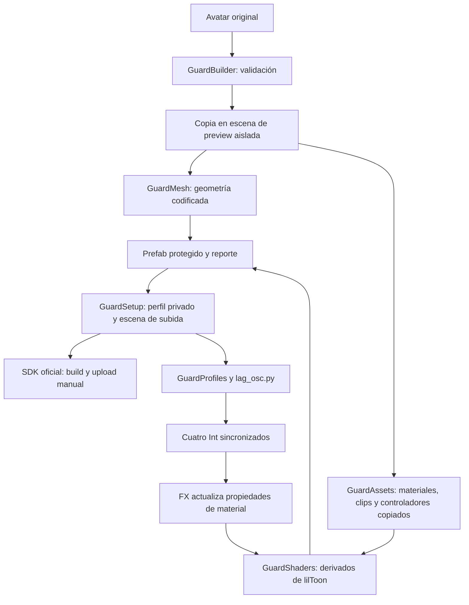

# Auditoría de la arquitectura actual

Fecha: 2026-10-01. Base: Linux Avatar Guard 0.2.1, commit `7f3ebc3de05b7f59aefb6949c1e9addc44d2ca3a`.

Documento de entrada: `LinuxAvatarGuard_SECURITY_ROADMAP.md`, apartado 45. Esta iteración analiza el sistema, añade una baseline adversarial y diseña la transición. No sustituye el codec productivo.

Este documento conserva la auditoría del estado inicial 0.2.1. Los cambios de la continuación y el experimento GPU posterior se registran en [ROADMAP_STATUS.md](ROADMAP_STATUS.md) y [GPU_CAPTURE_THREAT_MODEL.md](GPU_CAPTURE_THREAT_MODEL.md).

## Rutas y alcance

| Ruta | Función y tratamiento |
| --- | --- |
| `Package/Assets/LinuxAvatarGuard/` | Fuente distribuible del paquete; punto de partida de cualquier refactor. |
| `Tests/` | Pruebas públicas con fixtures sintéticas. Los fixtures comerciales permanecen excluidos de Git. |
| `ValidationProject/` | Proyecto local aislado para las pruebas; no forma parte del paquete. |
| `Assets/LinuxAvatarGuardGenerated/<BuildID>/` | Assets generados dentro de cada proyecto Unity. |
| `Library/LinuxAvatarGuard/<BuildID>.json` | Copia inicial de la configuración privada; no se exporta. |
| `${XDG_DATA_HOME:-~/.local/share}/linux-avatar-guard/<BuildID>/` | Respaldo privado y lanzador OSC actual, con directorios 0700 y configuración 0600. |
| `UserSettings/` | Registro local de perfiles y rutas. No contiene los cuatro valores de desbloqueo. |
| `evidence/` y logs locales | Evidencia de validación; excluidos del repositorio y de la distribución. |

El proyecto del usuario `TestAntiRipCarukia` y sus perfiles publicados quedan fuera de los experimentos. El roadmap propone otra capitalización y estructura para el almacenamiento privado; Linux distingue mayúsculas. Debe conservarse el directorio actual y diseñar una migración explícita si llega a cambiar.

La exportación del paquete usa una lista de archivos permitidos. `.gitignore` es otra barrera de publicación, pero no controla lo que serializa Unity en un avatar. La seguridad del paquete y la seguridad del AssetBundle requieren verificaciones distintas.

## Flujo de preparación



`GuardBuilder` exige Unity Editor en Linux, Vulkan y Built-in Render Pipeline. Rechaza combinaciones que no puede preservar: scripts ausentes, integradores sin hornear, Cloth, MeshCollider, canales de protección ocupados, cambios de mesh animados y ciertos cambios de escala. Las mallas skinned requieren opt-in experimental; las blendshapes que alteran normales se rechazan.

La copia evita guardar assets ajenos que estén modificados. La prueba existente compara los archivos de dependencias originales antes y después. Esto demuestra el caso de prueba, no todas las configuraciones de un avatar comercial.

## Codec y claves

Implementación: [GuardMesh.cs](../Package/Assets/LinuxAvatarGuard/Editor/GuardMesh.cs) y [GuardShaders.cs](../Package/Assets/LinuxAvatarGuard/Editor/GuardShaders.cs).

Por vértice:

```text
c = cuatro coeficientes aleatorios por vértice
k = cuatro valores enteros compartidos por el build
p_protected = p_original + normal * dot(c, k / 255)
p_decoded   = p_protected - normal * dot(c, k / 255)
```

`c.xy` se almacena en UV7 y `c.zw` en UV8, índices 6 y 7 de Unity. El shader utiliza `input.uv6`, `input.uv7` y `_LAGKey0..3`. El algoritmo, los canales y los nombres de propiedades son constantes. Cada build cambia coeficientes, valores y ruta de shader; no cambia la familia de decoder. Tampoco hay seed explícito para reproducir los buffers.

Se conservan índices, normales, tangentes, UV existentes, colores, bindposes, pesos y blendshapes admitidas. El desplazamiento solo altera una dirección local por vértice; la información tangencial permanece recuperable. Con normales conocidas se preservan dos grados de libertad geométricos. La prueba añadida demuestra este efecto en un plano sintético.

`NewKey()` obtiene cuatro bytes de un CSPRNG y aplica `32 + byte % 224`. El espacio efectivo es `224^4`, aproximadamente 31,23 bits de soporte, con distribución ligeramente sesgada. Los 32 bits del presupuesto de expresiones son un coste de transporte, no una garantía criptográfica. La observabilidad de esos valores es una debilidad más importante que el tamaño del espacio.

Existe una sola clave de runtime por build. No hay master key separada ni derivación por mesh. Una misma mesh original compartida por varios renderers produce una sola copia codificada.

## lilToon, materiales y skinning

`GuardShaders` genera derivados, conserva la licencia de lilToon y remapea `UsePass`. Inyecta la reconstrucción en `LIL_CUSTOM_VERTEX_OS`; no modifica el paquete original. Copia las variantes permitidas y comprueba errores de compilación.

`GuardAssets` mantiene una correspondencia global `objeto original → copia`. Los materiales se duplican, pero sus referencias a texturas permanecen originales. Esto implica que albedo, normal maps, máscaras y emisiones continúan siendo extraíbles. Las curvas de intercambio de materiales se remapean en clips copiados; un futuro decoder por mesh necesita que ese remapeo también conozca el renderer destinatario.

En lilToon 2.3.4, `lil_common_vert.hlsl` invoca el hook sobre la entrada recibida por el shader. La extensión está documentada en el [formato oficial de custom shaders](https://lilxyzw.github.io/lilToon/ja_JP/dev/custom_shader_format.html). El hook por sí solo no garantiza el orden `decode → skinning` del roadmap: Unity controla cómo entrega la geometría animada al shader. Hay que validar CPU/GPU skinning, normalización de normales, blendshapes y poses. Las rotaciones de un solo hueso y dos huesos comprobadas actualmente cubren casos concretos; no prueban que cualquier transformación reversible sea compatible.

Linux/Vulkan es el entorno de autoría y de estas pruebas. La subida PC usa assets para Windows64. Una imagen correcta en el Editor Vulkan no certifica por sí sola todas las variantes del cliente VRChat.

## OSC y almacenamiento privado

`GuardBuilder.AddDrivers` añade cuatro parámetros `Int` sincronizados, con valores predeterminados cero y `saved=false`; ocupa 32 bits adicionales. Cuatro capas FX contienen 256 estados cada una. Las propiedades del material reciben el valor seleccionado, pero ningún estado identifica por sí mismo la clave correcta.

`lag_osc.py` exige Linux, configuración del usuario actual y permisos privados. Utiliza loopback, espera el avatar vinculado y puede verificar sus parámetros mediante OSCQuery. Cambiar de avatar pausa el envío. El estado del proceso no imprime las claves.

OSC transporta valores de parámetros del avatar, como describe la [documentación oficial](https://docs.vrchat.com/docs/osc-avatar-parameters). En este proyecto, además, esos parámetros están marcados como sincronizados en el SDK. Por diseño deben considerarse observables; permisos 0600 protegen el archivo local frente a otros usuarios, no esos valores después de enviarlos ni frente al mismo usuario/root.

El formato privado actual es `format=1`; el sender exige cuatro nombres `LAG_<8 hex>_[0-3]`. `GuardProfiles.BuildId` reconoce el directorio generado o el prefijo `LinuxAvatarGuard/<BuildID>/` del shader. Renombrar parámetros o shaders sin un esquema y un resolver compatibles rompería perfiles, OSC y detección de la copia protegida.

## Validación y ciclo de vida

`GuardBuilder` recorre las dependencias de la copia y rechaza referencias a meshes que no sean las codificadas. Este control ocurre antes del procesamiento final del SDK. No demuestra que todo el AssetBundle final carezca de mallas originales o secretos. Queda por inspeccionar el resultado serializado, subassets de modelos/Avatar y el efecto de callbacks posteriores.

El builder revierte sus assets generados y archivo de clave si falla dentro de su bloque. La operación completa de `GuardSetup` incluye registro de perfil, respaldo y guardado de escena después de ese bloque. Un fallo tardío puede dejar una preparación parcial. Falta una transacción de preparación completa y estados persistentes `Preparing / Ready / Failed`.

El reporte público actual tiene formato 1 y datos de build, pero no una versión de codec ni manifiesto de seguridad. No existe un validador conectado al botón de build del SDK. La [API oficial de callbacks de build](https://creators.vrchat.com/sdk/build-pipeline-callbacks-and-interfaces/) permite rechazar solicitudes; la elección de hooks y su orden debe comprobarse contra el SDK objetivo antes de implementar la revisión posterior al procesamiento.

## Comparación con el roadmap

| Capacidad | 0.2.1 verificado | Brecha o condición del diseño |
| --- | --- | --- |
| Ofuscación de geometría | Desplazamiento lineal y payload aleatorio | Fórmula universal; no es cifrado fuerte. |
| Polimorfismo | Cambian coeficientes y rutas | Faltan IR, operaciones diversas y evaluación de un extractor adaptativo. |
| Aislamiento por mesh | Clave común; copia compartida por mesh fuente | Derivación y materiales/animaciones ligados al codec concreto. |
| Atributos | UV7/UV8 fijos, ocupación rechazada | Asignación conservadora según funciones de shader y procesamiento del SDK. |
| Texturas | Referencias originales | Investigación de sampling, mipmaps y compresión antes de TextureGuard. |
| Metadatos | Nombres identificables | Renombrado condicionado a integraciones y esquema compatible. |
| Fingerprints y canaries | Ausentes | Requieren detector calibrado y pruebas de supervivencia. |
| Secretos privados | Fuera de Assets, permisos privados | Master seed separado, manifest privado y auditoría del artefacto final. |
| No destructivo | Copia y pruebas de preservación | Extender la transacción a perfil y escena; pruebas de fallos tardíos. |
| GPU | Decode en vertex shader | No impide observación de salida del shader. |
| Compatibilidad | Fixtures y comprobación anterior de Carukia | Matriz de poses, funciones y cliente; sin certificación general. |
| Versionado | Versión de herramienta y `format=1` | `LAGVersion`, `SchemaVersion` y `CodecVersion` separados. |

## Modelo de amenazas aplicado

| Nivel | Evaluación actual |
| --- | --- |
| L0: recuperación de bundle | La geometría requiere corrección; las texturas siguen listas para reutilizar. |
| L1: extracción de assets | Payload y normales viajan con la mesh; estructura y atributos relevantes permanecen. |
| L2: recuperación de parámetros | Los cuatro valores permiten aplicar la fórmula pública. Debilidad reproducida. |
| L3: análisis de shader | Hook y nombres estables; basta identificar la misma fórmula. |
| L4: extractor específico de LAG | Un solo decoder independiente resolvió 100 muestras codificadas. |
| L5: captura GPU | Riesgo no mitigado de forma demostrada. No se realizó captura gráfica adversarial en esta iteración. |
| L6: ingeniería inversa dedicada | No existe garantía de impedirla. |

RenderDoc permite inspeccionar entradas y salidas de vertex shader, según su [documentación del Mesh Viewer](https://github.com/baldurk/renderdoc/blob/v1.x/docs/window/mesh_viewer.rst). La reconstrucción tardía puede ocultar la malla completa en el buffer de entrada, pero la geometría renderizable aparece después. Inferimos que fragmentar la entrada no basta para bloquear ese camino; recuperar rest pose puede requerir más información o varias poses. Debe medirse con contenido propio y sin alterar el cliente VRChat.

El polimorfismo puede aumentar el trabajo de análisis. Como el decoder y sus datos deben llegar al cliente, no garantiza que sea imposible crear un intérprete o extractor genérico más sofisticado. Fallar al reutilizar literalmente la configuración A sobre B mide separación de configuraciones; no prueba resistencia frente a un extractor que lea la configuración de B.

## Pruebas de esta iteración

Entorno: Unity 2022.3.22f1, SDK Avatars 3.10.5, lilToon 2.3.4, Vulkan e Intel Arc A750. Ejecución en proyecto aislado, con fixtures propias.

- `LAGValidation.Run`: 26 comprobaciones de preservación, FX, materiales animados, rechazo de entradas incompatibles y render Vulkan. Diferencia visual desbloqueada y de las dos fixtures skinned: 0 en esta ejecución.
- `LAGSecurityBaseline.Run`: 14 comprobaciones; incluye debilidades que deben reproducirse en el codec legacy. Decoder independiente correcto, valores ausentes/incorrectos, geometría tangencial conservada y recuperación con plaintext conocido y correspondencias de vértices.
- `test_osc.py`: 6 pruebas correctas, incluido transporte local, permisos, detección de avatar y pausa por cambio. No certifican el comportamiento de otros clientes conectados a una instancia de VRChat.

En 100 ejecuciones del encoder hubo 100 payloads distintos y el mismo decoder reconstruyó todas con sus parámetros observados. Son 100 muestras del codec, no 100 uploads ni 100 AssetBundles completos. En la fixture plana, RMS reconstruido 0; la clave ausente y una clave incorrecta producen RMS superior a 0,01 unidades.

La recuperación con plaintext conocido utiliza ambas mallas y correspondencias: no afirma obtener la clave de cualquier avatar a partir de la malla protegida sola. La baseline pública usa valores de ejemplo, nunca claves del usuario.

Resultados locales: `evidence/validation.json`, `evidence/security-baseline.json` y `security-roadmap-baseline-clean.log`. Un primer arranque recompiló después de una referencia transitoria a `GuardText`; se repitió la ejecución para separar importación y validación. El estado final y las limitaciones de los logs se registran en [ROADMAP_STATUS.md](ROADMAP_STATUS.md).

## Prioridades

1. Mantener el codec legacy y sus perfiles; diseñar versionado y adaptador antes de reemplazarlo.
2. Auditar el build final, la transacción y la exposición GPU antes de habilitar un codec nuevo en avatares publicados.
3. Prototipar diversidad por build y mesh sobre geometría estática propia; evaluar también un decoder adaptativo.
4. Resolver el contrato de skinning y el remapeo contextual de materiales antes de extender el prototipo a Carukia.
5. Investigar TextureGuard y fingerprinting como capas separadas con pruebas específicas.

Diseño propuesto: [POLYMORPHIC_CODEC_DESIGN.md](POLYMORPHIC_CODEC_DESIGN.md). Plan y criterios de avance: [ROADMAP_STATUS.md](ROADMAP_STATUS.md).
